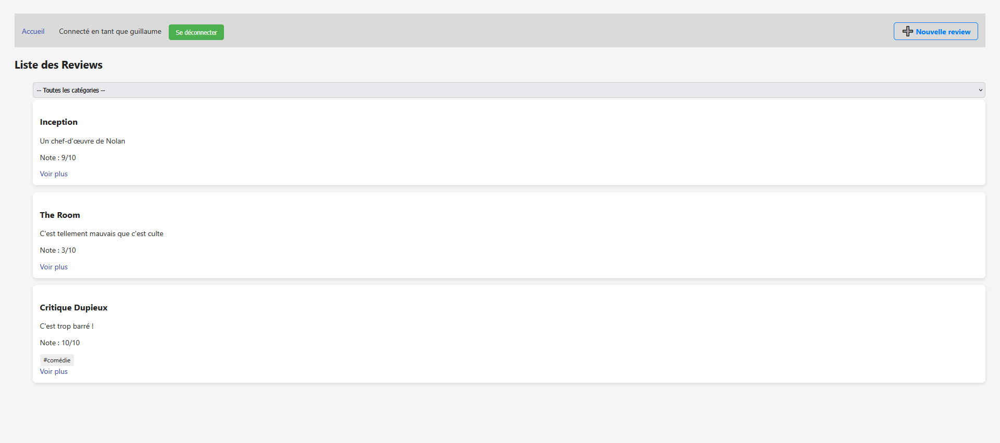
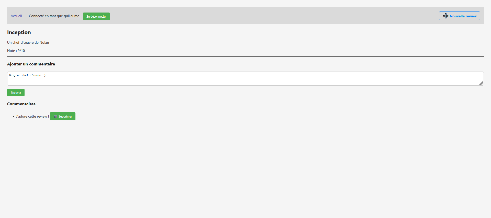
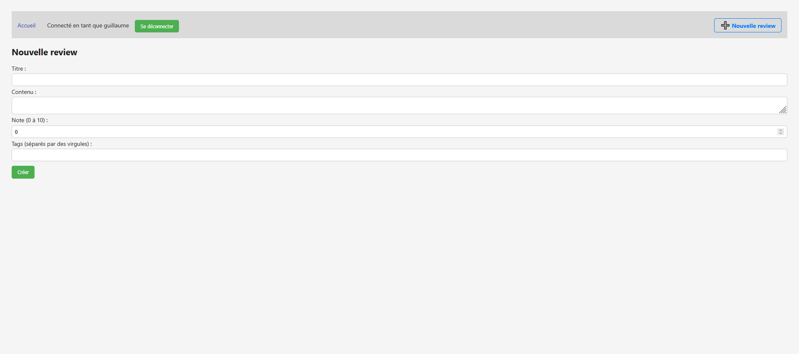
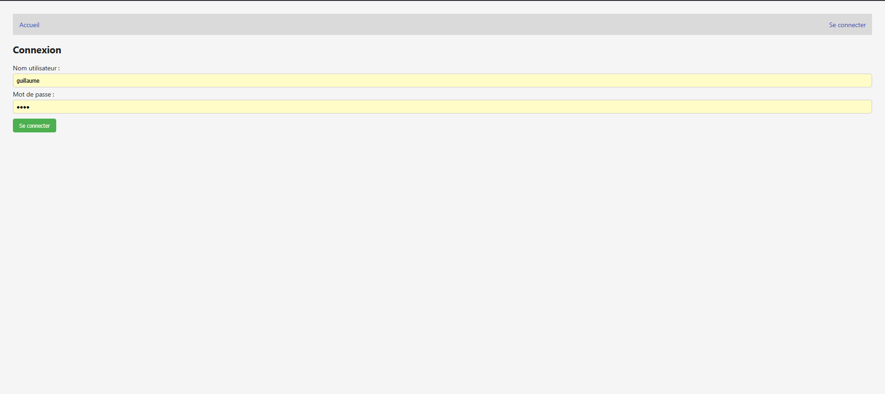

### **📝 CriticZone – Application de critiques culturelles 🎮📚**

CriticZone est une application web permettant aux utilisateurs de publier des critiques, commenter celles des autres, filtrer les contenus par catégories (tags), et gérer leur profil via un système d’authentification JWT sécurisé.

## **✨ Fonctionnalités principales**

- 🔐 Authentification des utilisateurs (connexion automatique ou création à la volée)

- 📝 Création, édition et suppression de critiques

- 💬 Ajout de commentaires (avec profondeur limitée)

- 🧹 Catégorisation des critiques avec tags multiples

- 🔎 Filtrage des critiques par tag

- 👤 Affichage du profil utilisateur dans la barre de navigation

- 🖼️ Interface utilisateur moderne avec Angular

---
## **🚀 Technologies utilisées**

Backend : ASP.NET Core + Entity Framework Core

Frontend : Angular (Standalone Components)

Base de données : SQL Server / SQLite

Sécurité : JWT (JSON Web Token)

---
## **📷 Captures d’écran**

🏠 Page d’accueil avec liste des reviews

✏️ Sélection d'une critique

✏️ Ajout d'une critique

🔐 Connexion utilisateur

---
## **⚙️ Lancer le projet en local**

1. Cloner le dépôt

- git clone https://github.com/ton-pseudo/criticzone.git
- cd criticzone

2. Backend – .NET

- cd CriticZoneApp
- dotnet ef database update
- dotnet run

3. Frontend – Angular

- cd critic-zone-ui
- npm install
- ng serve

Accès : http://localhost:4200

---
## **🙌 Auteur**
👤 Guillaume — Développeur Full Stack C# / .NET passionné par l'applicatif
